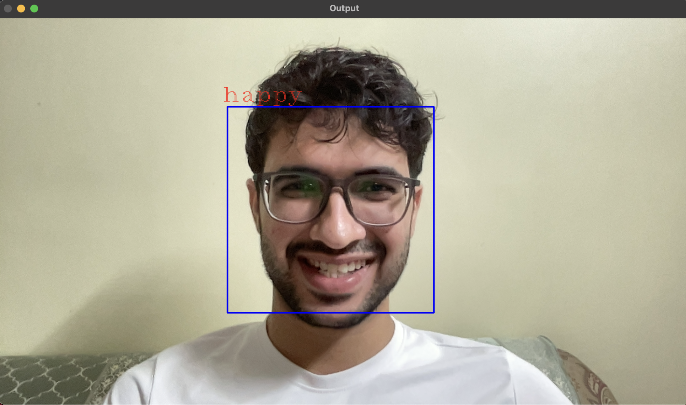

# Real-time Face Emotion Recognition

_This project aims to detect and classify the facial expressions through a live video feed into emotional states like happy, sad, angry, etc. This system utilizes Convolutional Neural Networks (CNN) implemented in Python, to capture video and predict emotions in real-time._

---
<h2>Overview</h2>
The project involved a full machine learning workflow, from data acquisition and preprocessing to model training and deployment. Utilizing Python, TensorFlow, Keras, Pandas, NumPy, and OpenCV to build and train the model. Acquired and processed a dataset of 36,000 facial images. Built and trained a CNN model to accurately classify reactions like happy, sad, angry, etc with an accuracy of 83%.

---

<h2>Tools & Libraries</h2>

- Python - For core programming.
- NumPy, Pandas - For efficient numerical operations and data manipulation.
- OpenCV - For real time image capturing and face recognition.
- TensorFlow, Keras - For building, training, and deploying the CNN model.
- Scikit-learn - For categorizing data into predefined classes.

---

<h2>Real-Time Pipeline Flow</h2>

- Capture: OpenCV captures a frame from the webcam.
- Detection: Then identifies all faces in the frame, returning bounding box coordinates.
- Preprocessing: Each detected face region is cropped and resized to 48x48 pixels and converted to grayscale and normalized.
- Inference: The preprocessed image is passed to the loaded CNN model.
- Classification: The model predicts the probability for each of the 7 emotion classes.
- Visualization: The predicted emotion (e.g., "Happy") and its confidence score are drawn onto the frame using OpenCV's drawing functions.

---

<h2>Result</h2>

---

<h2>Future Enhancements</h2>
- Improve face detection accuracy to reliably find faces in various angles and conditions.
- Expand the training dataset to classify more subtle or complex emotional states beyond the basic seven.
- Can be put to use for real life application involving determining real time emotion recognition.
